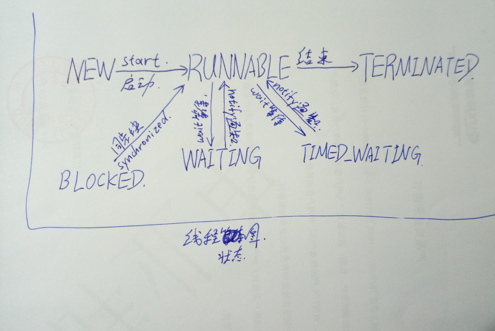

# 走入并行世界

## 基本定义

1. 同步：调用一旦开始，调用者必须等待方法调用返回后，才能继续后续行为。

2. 异步：类似于消息传递，一旦开始，方法调用就会立刻返回，调用者可以继续后续的操作。

3. 并发：偏重于多个任务交替执行，有可能多个任务之间串行。

4. 并行：同时执行。同时开始，各执行各的

5. 临界区：公共资源或者共享数据，可以被多个线程使用，但是每一次只能有一个线程使用，其他的线程想要使用就必须等待。

6. 阻塞&非阻塞：一个线程占用了临界区资源，导致其他线程等待（挂起）。

7. 死锁：

8. 饥饿：

9. 活锁：

10. 并发级别：阻塞、无饥饿、无障碍、无锁、无等待

11. RCU：一种典型的无等待结构（Read-Copy-Update）

12.并行定律：
  - Amdahl 定律：

> 加速比定义：加速比 = 优化前系统耗时 / 优化后系统耗时

  - Gustafson 定律：


## Java 内存模型 JMM

1. 原子性：操作不可中断，不会收到其他线程的干扰


```
package concorrency;

/**
 * Created by caoyx on 2017/4/10 0010.
 */
public class MultiThreadLong {
    public static long t = 0;
    public static class ChangeT implements Runnable {
        private long to;
        public ChangeT(long to) {
            this.to = to;
        }

        @Override
        public void run() {
            while (true) {
                MultiThreadLong.t = to;
                Thread.yield();
            }
        }
    }
    public static class ReadT implements Runnable {

        @Override
        public void run() {
            while (true) {
                long tmp = MultiThreadLong.t;
                if (tmp != 111L && tmp != -999L && tmp != 333L & tmp != 444L) {
                    System.out.println(tmp);
                }
                Thread.yield();
            }
        }
    }

    public static void main(String[] args) {
        new Thread(new ChangeT(111L)).start();
        new Thread(new ChangeT(-999L)).start();
        new Thread(new ChangeT(333L)).start();
        new Thread(new ChangeT(-444L)).start();
        new Thread(new ReadT()).start();
    }
}
```

2. 可见性：当一个线程修改了某个共享变量的值，其他线程是否能够立即知道这个修改。

3. 有序性：

指令重排：一条指令可以分为以下几步：

- 取指 IF
- 译码和取存储器操作数 ID
- 执行或者有效地址计算 EX
- 存储器访问 MEM
- 写回 WB

流水线技术：

    指令一： IF   ID   EX   MEM   WB
    指令二：      IF   ID   EX    MEM   WB
    
指令重排的基本原则：

- 程序顺序原则：一个县城内保证语义的串行性
- volatile 规则：volatile 变量的写，必先发生于读，保证 volatile 变量的可见性
- 锁规则：解锁必然发生在随后的加锁前
- 传递性：A 先于 B，B 先于 C，那么 A 先于 C
- 线程的 start() 先于它的每一个动作
- 线程的中断 interrupt() 先于被中断线程的代码
- 对象的构造函数执行、结束先于 finalize() 方法


# Java 并行程序的基础

## 线程的生命周期



## 线程的状态

- NEW 刚刚创建好的线程，未执行
- RUNNINGABLE 执行状态，一切资源都已就绪
- BLOCK 阻塞状态，等待获得锁
- WAITING 无时间限制的等待
- TIMED_WAITING 有时间限制的等待
- TERMINNATED 县城执行结束

## 终止线程

> Thread.stop() 不推荐使用。使用Thread.stop()方法终止线程的时候，会立即释放这个线程所持有的锁，而这些锁就是用来维持对象一致性的。

错误的姿势：

```
public class StopThreadUnsafe {
    public static User user = new User();
    public static class User {
        private int id;
        private String name;
        public User() {
            id = 0;
            name = "0";
        }

        public int getId() {
            return id;
        }

        public void setId(int id) {
            this.id = id;
        }

        public String getName() {
            return name;
        }

        public void setName(String name) {
            this.name = name;
        }

        @Override
        public String toString() {
            return "User [id=" + id + ", name=" + name + "]";
        }
    }

    public static class ChangeObjectThread extends Thread {
        @Override
        public void run() {
            while (true) {
                synchronized (user) {
                    int v = (int)(System.currentTimeMillis()/1000);
                    user.setId(v);
                    try {
                        Thread.sleep(100);
                    } catch (InterruptedException e) {
                        e.printStackTrace();
                    }
                    user.setName(String.valueOf(v));
                }
                Thread.yield();
            }
        }
    }

    public static class ReadObjectThread extends Thread {
        @Override
        public void run() {
            while (true) {
                synchronized (user) {
                    if (user.getId() != Integer.parseInt(user.getName())) {
                        System.out.println(user.toString());
                    }
                }
                Thread.yield();
            }
        }
    }

    public static void main(String [] args) throws InterruptedException {
        new ReadObjectThread().start();
        while (true) {
            Thread t = new ChangeObjectThread();
            t.start();
            Thread.sleep(100);
            t.stop();
        }
    }
}

```

正确的姿势：

```
public static class ChangeObjectThread extends Thread {
        volatile boolean stopme = false;
        public void stopMe() {
            stopme = true;
        }
        @Override
        public void run() {
            while (true) {
                if (stopme) {
                    System.out.println("exit by stop me");
                    break;
                }
                synchronized (user) {
                    int v = (int)(System.currentTimeMillis()/1000);
                    user.setId(v);
                    try {
                        Thread.sleep(100);
                    } catch (InterruptedException e) {
                        e.printStackTrace();
                    }
                    user.setName(String.valueOf(v));
                }
                Thread.yield();
            }
        }
    }
    
```
## 线程的中断

> 线程的中断并不会是线程立即退出，而是给线程发出一个通知，告知目标线程，由目标线程自行决定如何处理

中断的方法：

- ```public void Thread.interrupt()``` 中断线程
- ```public boolean Thread,isInterrupted()``` 判断线程是否被中断 
- ```public static boolean Threqad.interrupted()``` 判断是否被中断，并清除当前中断状态


## 等待和通知

- ```public final void wait() throws InterruptedException ```
- ```public final native void notify() ```

当在一个对象实例上面调用了```wait()```
方法以后，当前线程就会在这个对象上等待，直到有其他的线程调用了```obj.notify()```方法为止。

```Object.wait()``` 调用必须包含在对应的```synchronzied```语句中。

```
public class SimpleWN {
    final static Object object = new Object();
    public static class T1 extends Thread {
        @Override
        public void run() {
            synchronized (object) {
                System.out.println(System.currentTimeMillis() + " : T1 start");
                try {
                    System.out.println(System.currentTimeMillis() + ": T1 wait for object");
                    object.wait();
                } catch (InterruptedException e) {
                    e.printStackTrace();
                }
                System.out.println(System.currentTimeMillis() + ": T1 end!");
            }
        }
    }

    public static class T2 extends Thread {
        @Override
        public void run() {
            synchronized (object) {
                System.out.println(System.currentTimeMillis() + " : T2 start! notify one thread");
                object.notify();
                System.out.println(System.currentTimeMillis() + ": T2 end!");
                try {
                    Thread.sleep(2000);
                } catch (InterruptedException e) {
                    e.printStackTrace();
                }
            }
        }
    }

    public static void main(String[] args) {
        Thread t1 = new T1();
        Thread t2 = new T2();
        t1.start();
        t2.start();
    }
}
```
注意：```Object.wait()```和```Thread.sleep()```都可以让线程等待一定的时间，但是```Object.wait()```会释放目标对象的锁。

## 挂起和继续执行线程

线程的挂起```suspend()```和继续执行```resume()```已被废弃，不推荐使用。

```suspend()``` 在导致线程被暂停的同时，并不会释放任何锁的资源。如果```resume()```是在```suspend()```之前执行，那么被挂起的线程无法继续执行，并且无法释放锁。

使用```wait()```和```notify()```方法可以代替上述的两个方法。

```
public class GoodSuspend {
    public static Object object = new Object();

    public static class ChangeObjectThread extends Thread {
        volatile boolean suspendme = false;

        public void suspendMe() {
            suspendme = true;
        }

        public void resumeMe() {
            suspendme = false;
            synchronized (this) {
                notify();
            }
        }

        @Override
        public void run() {
            while (true) {
                synchronized (this) {
                    try {
                        wait();
                    } catch (InterruptedException e) {
                        e.printStackTrace();
                    }
                }
                synchronized (object) {
                    System.out.println("in ChangeObjectThread");
                }
                Thread.yield();
            }
        }
    }

    public static class ReadObjectThread extends Thread {
        @Override
        public void run() {
            while (true) {
                synchronized (object) {
                    //System.out.println("in ReadObjectThread");
                }
                Thread.yield();
            }
        }
    }

    public static void main(String[] args) throws InterruptedException {
        ChangeObjectThread t1 = new ChangeObjectThread();
        ReadObjectThread t2 = new ReadObjectThread();
        t1.start();
        t2.start();
        Thread.sleep(1000);
        t1.suspendMe();
        System.out.println("suspend t1 2 sec");
        Thread.sleep(2000);
        System.out.println("resume t1");
        t1.resumeMe();
    }
}
```

## 等待线程结束 ```join``` 和谦让 ```yield``` 

- ```public final void join() throws InterruptedException``` 无线等待，一直阻塞当前线程直到目标线程执行完毕
- ```public final synchronized voi join(long millis) throws InterruptedException``` 根据给定时间等待，超过时间则继续执行

- ```public staitc native void yield();``` 

## ```volatile```与 Java 内存模型JMM


## 线程组

```
public class ThreadGroupName implements Runnable {
    @Override
    public void run() {
        String groupAndName = Thread.currentThread().getThreadGroup().getName() + "-" + Thread.currentThread().getName();
        while (true) {
            System.out.println("I am " + groupAndName);
            try {
                Thread.sleep(3000);
            } catch (InterruptedException e) {
                e.printStackTrace();
            }
        }
    }

    public static void main(String[] args) {
        //创建线程组
        ThreadGroup tg = new ThreadGroup("PrintGroup");
        //将t1、t2两个线程加入到线程组中
        Thread t1 = new Thread(tg, new ThreadGroupName(), "T1");
        Thread t2 = new Thread(tg, new ThreadGroupName(), "T2");
        t1.start();
        t2.start();
        //获取活动线程总数，但是只是一个估计值
        System.out.println(tg.activeCount());
        //打印线程组中的所有的线程信息
        tg.list();
    }
}
```

## 守护线程 ```Deamon```

```
public class DeamonDemo {
    public static class DeamonT extends Thread {
        public void run() {
            while (true) {
                System.out.println("I am alive");
                try {
                    Thread.sleep(1000);
                } catch(InterruptedException e) {

                }
            }
        }
    }

    public static void main(String[] args) throws InterruptedException {
        Thread t = new DeamonT();
        t.setDaemon(true);//守护线程必须在 start 方法之前设置，否则会报异常
        t.start();
        Thread.sleep(2000);
        //将 t 设置为守护线程，系统中只有 main 是用户线程，当 main 线程结束时，
        // 守护线程也结束
    }
}

```

## 线程优先级

Java 中，使用 1 至 10 来表示线程的优先级，一般使用内置的三个静态变量表示

> public final static int MIN_PRIORITY = 1
> public final static int NORM_PRIORITY = 5
> public final static int MAX_PRIORITY = 10

```
public class PriorityDemo {
    public static class HighPriority extends Thread {
        static int count = 0;
        public void run() {
            while (true) {
                synchronized (PriorityDemo.class) {
                    count ++;
                    if (count > 1000000) {
                        System.out.println("HighPriority is complete");
                        break;
                    }
                }
            }
        }
    }

    public static class LowPriority extends Thread {
        static int count = 0;
        public void run() {
            while (true) {
                synchronized (PriorityDemo.class) {
                    count ++;
                    if (count > 1000000) {
                        System.out.println("LowPriority is complete");
                        break;
                    }
                }
            }
        }
    }

    public static void main(String[] args) {
        Thread high = new HighPriority();
        Thread low = new LowPriority();
        high.setPriority(Thread.MAX_PRIORITY);
        low.setPriority(Thread.MIN_PRIORITY);
        low.start();
        high.start();
    }

}
```

## 线程安全

```synchronized``` 关键字用于实现线程间的同步，对同步的代码加锁。主要用法有：

- 指定加锁对象：给指定的对象加锁，进入同步代码前要获取对象的锁
- 直接作用于实例方法，相当于对当前实例加锁，进入同步代码前要获取当前实例的锁
- 直接作用于静态方法：相当于对当前类加锁，进入同步代码前要获得当前类的锁

```
public class AccountingSync implements Runnable {
    static AccountingSync instance = new AccountingSync();
    static int i = 0;
    @Override
    public void run() {
        for (int j = 0; j < 10000000; j ++) {
            synchronized(instance) {
                i ++;
            }
        }
    }

    public static void main(String[] args) throws InterruptedException {
        Thread t1 = new Thread(instance);
        Thread t2 = new Thread(instance);
        t1.start();
        t2.start();
        t1.join();
        t2.join();
        System.out.println(i);
    }
}
```

另一种写法

```
public class AccountingSync implements Runnable {
    static AccountingSync instance = new AccountingSync();
    static int i = 0;

    public synchronized void increase() {
        i ++;
    }

    @Override
    public void run() {
        for (int j = 0; j < 10000000; j ++) {
            increase();
        }
    }

    public static void main(String[] args) throws InterruptedException {
        Thread t1 = new Thread(instance);
        Thread t2 = new Thread(instance);
        t1.start();
        t2.start();
        t1.join();
        t2.join();
        System.out.println(i);
    }
}
```

## 并发下的 ```ArrayList```

```
public class ArrayListMutiThread {

    static ArrayList list = new ArrayList<Integer>(10);
    public static class AddThread implements Runnable {
        @Override
        public void run() {
            for (int i = 0; i < 1000000; i++) {
                list.add(i);
            }
        }
    }

    public static void main(String[] args) throws InterruptedException {
        Thread t1 = new Thread(new AddThread());
        Thread t2 = new Thread(new AddThread());
        t1.start();
        t2.start();
        t1.join();
        t2.join();
        System.out.println(list.size());
    }
}
```

## 并发下的 ```HashMap```

```HashMap``` 同样也不是线程安全。
```
public class HashMapMultiThread {
    static Map<String, String> map = new HashMap<String, String>();

    public static class AddThread implements Runnable {
        int start = 0;
        public AddThread(int start) {
            this.start = start;
        }

        @Override
        public void run() {
            for (int i = start; i < 100000; i += 2) {
                map.put(Integer.toString(i), Integer.toBinaryString(i));
            }
        }
    }

    public static void main(String[] args) throws InterruptedException {
        Thread d1 = new Thread(new HashMapMultiThread.AddThread(0));
        Thread d2 = new Thread(new HashMapMultiThread.AddThread(1));
        d1.start();
        d2.start();
        d1.join();
        d2.join();
        System.out.println(map.size());
    }
}
```

可能出现的结果有三种：

1. 程序正常结束，结果符合预期，HashMap的大小为100000；
2. 程序正常结束，结果不符合预期，HashMap的大小小于100000；
3. 程序无法结束。（Java8中不会出现）

## 错误的加锁

```
public class BadLockOnInteger implements Runnable {
    public static Integer i = 0;
    static BadLockOnInteger instance = new BadLockOnInteger();
    @Override
    public void run() {
        for (int j = 0; j < 10000000; j++) {
            synchronized (i) {
                i ++;
            }
        }
    }

    public static void main(String[] args) throws InterruptedException {
        Thread t1 = new Thread(instance);
        Thread t2 = new Thread(instance);
        t1.start();
        t2.start();
        t1.join();
        t2.join();
        System.out.println(i);
    }
}
```

错误的原因，正是因为```Integer```在 Java 中是不可变的对象，当执行```i++```时，实际上是```i = Integer.valueOf(i.intValue() + 1```，即```i```获取的是一个新的```Integer```对象的值的引用。

所以，多个线程之间，```i```一直在变，两个线程每次加锁都加载了不同的对象上面，导致临界区对代码控制出现问题。

修正方法：将```synchronized (i)```改为```synchronized (instance)```

# JDK 并发包

## 同步控制

1. ```synchronized``` 功能扩展：重入锁

```
import java.util.concurrent.locks.ReentrantLock;

/**
 * Created by caoyx on 2017/4/24 0024.
 */
public class ReenterLock implements Runnable {
    public static ReentrantLock lock = new ReentrantLock();
    public static int i = 0;
    @Override
    public void run() {
        for (int j = 0; j < 1000000; j ++) {
            lock.lock();
            try {
                i ++;
            } finally {
                lock.unlock();
            }
        }
    }

    public static void main(String[] args) throws InterruptedException {
        ReenterLock rl = new ReenterLock();
        Thread t1 = new Thread(rl);
        Thread t2 = new Thread(rl);
        t1.start();
        t2.start();
        t1.join();
        t2.join();
        System.out.println(i);
    }
}
```

可以看出，与 ````synchronized``` 不同，重入锁使用时，必须手动指定何时加锁，何时释放锁，对于逻辑的灵活性好于 ```synchronized```

重入锁的使用：
```
lock.lock();
lock.lock();
try {
    i ++;
} finally {
    lock.unlock();
    lock.unlock();
}
```
这种形式也是允许的，但是获得了几次锁就必须释放几次锁，否则其他线程无法使用资源。

> 中断响应：使用重入锁的线程，可以根据需要选择取消对锁的请求。

```
public class InLock implements Runnable {
    public static ReentrantLock lock1 = new ReentrantLock();
    public static ReentrantLock lock2 = new ReentrantLock();
    int lock;

    public InLock(int lock) {
        this.lock = lock;
    }

    @Override
    public void run() {
        try {
            if (lock == 1) {
                lock1.lockInterruptibly();
                try {
                    Thread.sleep(500);
                } catch (InterruptedException e) {

                }
                lock2.lockInterruptibly();
            } else {
                lock2.lockInterruptibly();
                try {
                    Thread.sleep(500);
                } catch (InterruptedException e) {

                }
                lock1.lockInterruptibly();
            }
        } catch (InterruptedException e) {

        } finally {
            if (lock1.isHeldByCurrentThread()) {
                lock1.unlock();
            }
            if (lock2.isHeldByCurrentThread()) {
                lock2.unlock();
            }
            System.out.println(Thread.currentThread().getId() + " 线程退出");
        }
    }

    public static void main(String[] args) throws InterruptedException {
        InLock r1 = new InLock(1);
        InLock r2 = new InLock(2);
        Thread t1 = new Thread(r1);
        Thread t2 = new Thread(r2);
        t1.start();
        t2.start();
        Thread.sleep(5000);
        t2.interrupt();
    }
}
```

对锁的请求，统一使用 ```lockInterruptibly()``` 方法，可以对中断进行响应。

> 等待限时

```
public class TimeLock implements Runnable {
    public static ReentrantLock lock = new ReentrantLock();

    @Override
    public void run() {
        try {
            if (lock.tryLock(5, TimeUnit.SECONDS)) {
                Thread.sleep(6000);
            } else {
                System.out.println("get lock failed");
            }
        } catch (InterruptedException e) {
            e.printStackTrace();
        } finally {
            if (lock.isHeldByCurrentThread()) {
                lock.unlock();
            }
        }
    }

    public static void main(String[] args) {
        TimeLock tl = new TimeLock();
        Thread t1 = new Thread(tl);
        Thread t2 = new Thread(tl);
        t1.start();
        t2.start();
    }
}
```

```tryLock()``` 带有两个参数，一个时等待时长，一个时计时单位。也可以不带参数直接运行，如果锁未被其他线程占用，则申请会成功，并立即返回 ```true``` ，如果锁被其他线程占用，则不会进行等待立即返回 ```false```

```
public class TryLock implements Runnable {
    public static ReentrantLock lock1 = new ReentrantLock();
    public static ReentrantLock lock2 = new ReentrantLock();
    int lock;

    public TryLock(int lock) {
        this.lock = lock;
    }

    @Override
    public void run() {
        if (lock == 1) {
            while (true) {
                if (lock1.tryLock()) {
                    try {
                        try {
                            Thread.sleep(500);
                        } catch (InterruptedException e) {
                            e.printStackTrace();
                        }
                        if (lock2.tryLock()) {
                            try {
                                System.out.println(Thread.currentThread().getId() + " My Job Done!");
                                return;
                            } finally {
                                lock2.unlock();
                            }
                        }
                    } finally {
                        lock1.unlock();
                    }
                }
            }
        } else {
            while (true) {
                if (lock2.tryLock()) {
                    try {
                        try {
                            Thread.sleep(500);
                        } catch (InterruptedException e) {
                            e.printStackTrace();
                        }
                        if (lock1.tryLock()) {
                            try {
                                System.out.println(Thread.currentThread().getId() + " My Job Done!");
                                return;
                            } finally {
                                lock1.unlock();
                            }
                        }
                    } finally {
                        lock2.unlock();
                    }
                }
            }
        }
    }

    public static void main(String[] args) {
        TryLock r1 = new TryLock(1);
        TryLock r2 = new TryLock(2);
        Thread t1 = new Thread(r1);
        Thread t2 = new Thread(r2);
        t1.start();
        t2.start();
    }
}
```

> 公平锁：按照时间先后顺序，保证先到先得，不会产生饥饿现象。使用 ```synchronized``` 产生的锁就是**非公平**的.

```
public class FairLock implements Runnable {
    public static ReentrantLock fairLock = new ReentrantLock();

    @Override
    public void run() {
        while (true) {
            try {
                fairLock.lock();
                System.out.println(Thread.currentThread().getName() + " 获得锁");
            } finally {
                fairLock.unlock();
            }
        }
    }
    public static void main(String[] args) {
        FairLock r1 = new FairLock();
        Thread t1 = new Thread(r1, "Thread_t1");
        Thread t2 = new Thread(r1, "Thread_t2");
        t1.start();
        t2.start();
    }
}
```
## Condition 条件

- void await() throws InterruptedException; 使当前线程等待，同时释放当前锁。当其他线程使用 ```signal()``` 或者 ```signAll()``` 方法时，线程会重新获得锁并继续执行。当线程被中断时也能跳出等待。
- void awaitUninterruptibly(); 和```await()```基本相同，但是不会在等待过程中相应中断。
- long awaitNanos(long nanosTimeout) throws InterruptedException; 
- boolean await(long time, TimeUnit unit) throws InterruptedException;
- boolean awaitUntil(Date deadline) throws InterruptedException;
- void signal(); 唤醒一个在等待中的线程。
- void signalAll(); 唤醒所有在等待中的线程。

```
public class ReenterLockCondition implements Runnable {

    public static ReentrantLock lock = new ReentrantLock();
    public static Condition condition = lock.newCondition();

    @Override
    public void run() {
        try {
            lock.lock();
            condition.await();
            System.out.println("Thread is going on");
        } catch(InterruptedException e) {
            e.printStackTrace();
        } finally {
            lock.unlock();
        }
    }

    public static void main(String[] args) throws InterruptedException {
        ReenterLockCondition rlc = new ReenterLockCondition();
        Thread t1 = new Thread(rlc);
        t1.start();
        Thread.sleep(2000);
        lock.lock();
        condition.signal();
        lock.unlock();
    }
}
```
